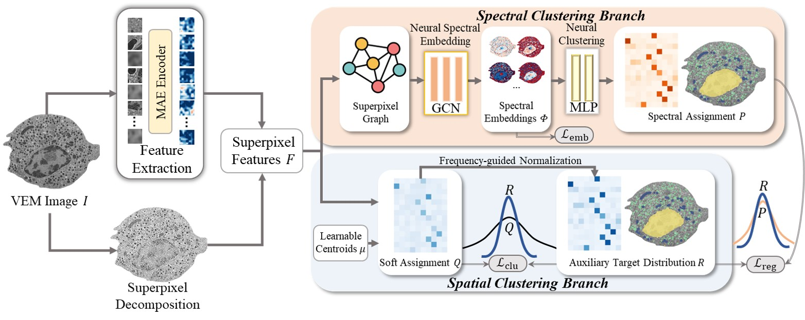

# CS2C
This repository contains the official implementation of the research paper: 

**"CS2C: Collaborative Spectral and Spatial Neural Clustering for Organelle Segmentation in Electron Microscopy**



___
## Requirements and Installation
### System Requirements
- Python version: 3.7 or higher
- PyTorch version: 1.8.1 or higher
### Installation
- To install the required Python packages, execute the following command:
```
pip install -r requirements.txt
```
## Data Preparation
  - Download the BetaSeg dataset from the official source [1].
  - And unzip the dataset, put it under `./data/betaseg`
  - We organize the dataset as:
    ```
    data/
    └── betaseg/
        ├── high_c4_segs/    # For evaluation only
        │   ├── high_c4_granules.tif
        │   ├── high_c4_mitochondria_mask.tif
        │   ├── high_c4_nucleus_mask.tif
        │   └── high_c4_membrane_full_mask.tif
        │   
        ├── high_c1_source.tif  # Original VEM images
        ├── high_c2_source.tif
        ├── high_c3_source.tif
        ├── high_c4_source.tif
        ├── high_c1_source.pt  # We use torchvision.ToTensor() to convert the VEM images, enabling faster loading.
        ├── high_c2_source.pt
        ├── high_c3_source.pt
        ├── high_c4_source.pt
        └── imgs_tensor.txt   # Path to the list of dataset image files
    ```
## MAE Pre-training
  - We use the same training strategy as MAESTER [2]. 
  - After traning, rename it to `maemodel.pt`, put the pretrained model under `./configs`. Or you can specify the path to the model in the yaml file in `./configs`.
## Training
- The training process is configured via a `YAML` file, and the training script can be run with specific configurations. 
Update the configuration file `./configs/default.yaml` to adjust the training parameters to your dataset. 
- You can then initiate training with the following command:
```
python train.py --model_config_dir ./configs --model_config_name default.yaml --save_dir ./checkpoints --plot_dir ./plots --cmd_log_dir ./logs
```
### Key Configuration Parameters (default.yaml)
- **MODEL**: Defines the architecture specifics.
- **DATASET**: Specifies paths for training and validation datasets, including images and preprocessed data.
- **ENGINE**: Controls training epochs, device settings, and logging details.
- **OPTIM**: Sets optimization parameters such as learning rate.

Please ensure all paths in the configuration are correctly set relative to your project directory.

## Testing
- For testing, use the following command to execute the test script, which will conduct segmentation and store results in the designated directory:
```
python test.py --model_config_dir ./configs --suffix default --pretrained_path [your tranined model]
```
- For evaluation, you can run `cal_metrics.py` to calculate DSC and IoU.
```
python cal_metrics.py --pred_name [your result]
```

___
### References
[1] Müller A, Schmidt D, Xu C S, et al. 3D FIB-SEM reconstruction of microtubule–organelle interaction in whole primary mouse β cells[J]. The Journal of cell biology, 2021, 220(2).

[2] Xie R, Pang K, Bader G D, et al. Maester: masked autoencoder guided segmentation at pixel resolution for accurate, self-supervised subcellular structure recognition[C]//Proceedings of the IEEE/CVF Conference on Computer Vision and Pattern Recognition. 2023: 3292-3301.
